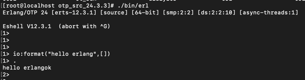

# rabbitmq

- docker-compose 安装组件rabbitmq
- 配置消息投递方
- 配置消息监听方（消息消费）


# 安装

## docker安装

````
version: "3.7"
services:
  rabbitmq-1:
    hostname: rabbitmq-host-1
    image: rabbitmq:3.8.9-management
    container_name: rabbitmq-1-container
    ports:
      - "5672:5672"
      - "15672:15672"
    volumes:
      - /data/log:/var/log/rabbitmq/log
    environment:
      - RABBITMQ_DEFAULT_VHOST=/
      - RABBITMQ_DEFAULT_USER=mqz
      - RABBITMQ_DEFAULT_PASS=mqz
    restart: on-failure
    privileged: true


````

## 安装包安装

- 1. rabbitmq基于erlang语言，所以需要先下载erlang
     注意rabbitmq和erlang的对应关系，官方图：

- 2. wget下载 erlang 安装包 (可以官网下载 https://www.erlang.org/downloads、git下载 https://github.com/erlang/otp/releases)
wget https://erlang.org/download/otp_src_25.0.tar.gz
- 3. 解压 erlang 安装包
tar -xvzf otp_src_19.3.tar.gz
- 4. 安装 erlang 的依赖工具
yum -y install make gcc gcc-c++ kernel-devel m4 ncurses-devel openssl-devel unixODBC-devel

- 5. 配置环境
./configure --prefix=/usr/local/erlang --without-javac
     
- 6. 安装、编译
make && make install

- 7. 验证安装是否成功
./bin/erl
- 接着命令台输出：
io:format("hello world~n", []).
  
- 8. 下载rabbitmq的rpm安装包 （https://github.com/rabbitmq/rabbitmq-server/releases/）
wget https://www.rabbitmq.com/releases/rabbitmq-server/v3.10.1/rabbitmq-server-3.10.1-1.el8.noarch.rpm

- 9.安装rpm
rpm --import https://www.rabbitmq.com/rabbitmq-release-signing-key.asc
- 10. 执行 yum install 
yum install rabbitmq-server-3.10.1-1.el8.noarch.rpm
- 11. 开启web管理插件
rabbitmq-plugins enable rabbitmq_management
- 10. 设置开机启动
chkconfig rabbitmq-server on

- 11 启动服务
service rabbitmq-server start
- 12查看服务状态
service rabbitmq-server status

- 13 初始默认用户为guest，并且指容许从 localhost 访问 ：
  “guest” user can only connect via localhost
- 创建用户并且赋予管理员最高权限
rabbitmqctl add_user root root
rabbitmqctl set_user_tags root administrator
rabbitmqctl set_permissions -p / root ".*" ".*" ".*"


