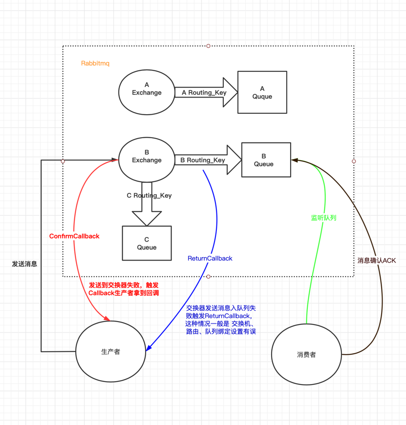

# rabbitmq内部结构及工作流程：

# rabbitmq

-  每个VirtualHost相当于一个相对独立的RabbitMQ服务器；
   每个VirtualHost之间是相互隔离的，exchange、queue、message不能互通
   

# Rabbitmq的ack确认机制：

   - 1.消息发送确认：确认生产者将消息发送给交换器、交换器传递（绑定）给队列过程是否成功投递，
             步骤：一是确认是否到达交换器，二是确认是否到达队列
     
   - 2.消费接收确认：确认消费者是否成功消费了队列中的消息，

# 消息发送确认：

   - 1. ConfirmCallback 回调方法
            消息发送到 Broker 后触发回调，确认消息是否到达 Broker 服务器，也就是只确认是否正确到达 Exchange 中。
    
   - 2. ReturnCallback 回调方法，
            交换器路由不到队列时触发回调，该方法可以不使用，因为交换器和队列是在代码里绑定的，如果消息成功投递到 Broker 后在绑定队列失败，除非你代码写错了

# 消息接收确认： 
    发生在监听队列的消费者处理业务失败，比如业务数据有误等，这种情况就需要手动处理，比如重新发送或者丢弃。

  - RabbitMQ默认的ack是自动确认的方式（auto），自动确认会在消息到达消费者后立即确认，存在丢失的可能性，如果消费端抛出异常消息就会丢失掉（若不手动处理）
    
  - 消费端确认模式：(配置文件中配置)
        AcknowledgeMode.AUTO ：根据情况确认
        AcknowledgeMode.NONE :  自动确认
        AcknowledgeMode.MANUAL ： 手动确认
    
  - 代码手动调用channel方法确认：
    
        channel.basicAck(long deliveryTag, boolean multiple); 用于确认当前消息。
        channel.basicNack(long deliveryTag, boolean multiple, boolean requeue); 用于否定当前消息（注意：这是AMQP 0-9-1的RabbitMQ扩展） 。
        channel.basicReject(long deliveryTag, boolean multiple); 用于拒绝当前消息。

        deliveryTag：
            唯一标识 ID，当一个消费者向 RabbitMQ 注册后，会建立起一个 Channel ，RabbitMQ 会用 basic.deliver 方法向消费者推送消息，
            这个方法携带了一个 delivery tag， 它代表了 RabbitMQ 向该 Channel 投递的这条消息的唯一标识 ID，是一个单调递增的正整数，delivery tag 的范围仅限于 Channel。
    
        multiple：是否批处理，当该参数为 true 时，则可以一次性确认 delivery_tag 小于等于传入值的所有消息

        requeue: 如果 requeue 参数设置为 true，则 RabbitMQ 会重新将这条消息存入队列，以便发送给下一个订阅的消费者； 如果 requeue 参数设置为 false，则 RabbitMQ 立即会还把消息从队列中移除，而不会把它发送给新的消费者

# 建议使用usually-queue 队列

# 死信队列 

     1 死信队列：DLX ， dead-letter-exchange
     2 死信： 当一个消息变成死信后，会被published到另外一个队列就是DLX死信队列

# 死信：
    1 消息被拒绝 channel.basicReject()、channel.basicNack() 并且requeue=false
    2 当前队列中的消息数量已经超过最大长度
    3 当前消息在队列中的存活时间已经超过了预先设置的TTL(Time To Live)时间

# 开启日志追踪 
    1. 进入rabbitmq执行 rabbitmq-plugins enable rabbitmq_tracing 开启日志追踪插件功能

# 消息投递保证：
    消息投递保证不可能100%都投递/消费成功，需要消息补偿机制：

    1. 消息成功投递，消费者成功接收：生产者->交换器、交换器->队列
    2. 交换机、路由、队列可靠性，设置他们持久化
    3. 消息成功被消费，消费方确认Ack机制
    4. 消息补偿机制：

    
        a. 生产者投递消息给mq后，同时持久化消息信数据并且初始化状态，在 ConfirmCallback 中消息投递成功后更新消息信数据状态 （考虑 ReturnCallback交换机经路由传递给队列true/false）！
        b. 分布式定时任务5分钟扫描DB获取未成功投递的消息信数据，并且重新投递给mq。
            存在mq挂掉，交换机路由队列误删的情况多次投递也无法成功，可以设置重新投递规则即重试机制，超过重试机制次数还是失败，更新消息信数据状态为指定值，留给后期人工去处理

#消息幂等性：
        请求高峰情况下，生产者成功发送了消息并且消费者已成功收到消息且消费成功，这个时候网络终端等情况导致消费端Ack未能返回给Mq（生产者）导致消息下一次会被重新消费

        解决方案：
                a. redis生成唯一标识
                b. uuid + 业务id 
    

    
 
        
        
    
    
    

