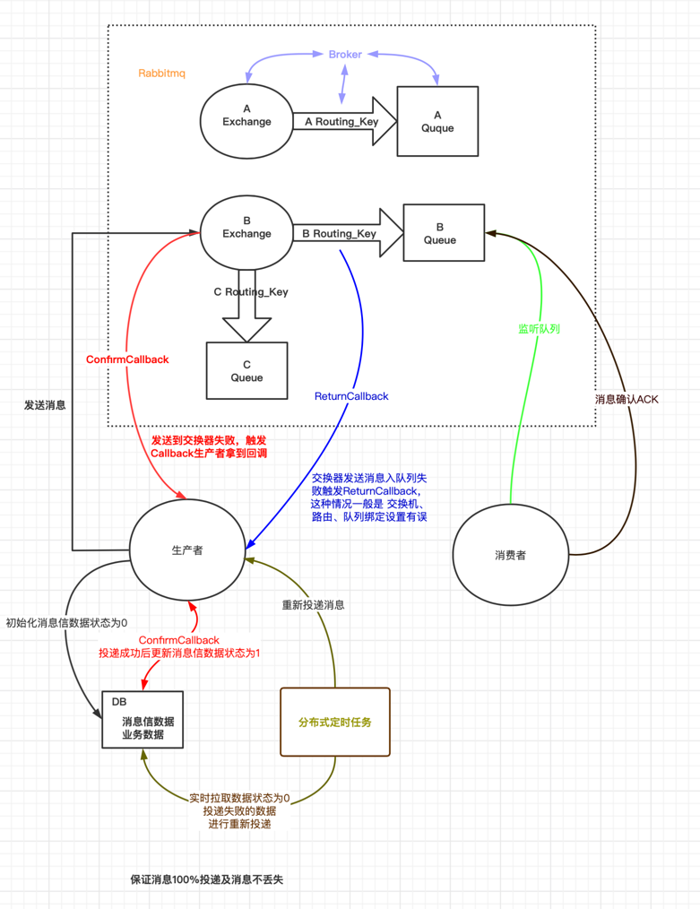

# rabbitmq内部结构及工作流程：



# rabbitmq
-  每个VirtualHost相当于一个相对独立的RabbitMQ服务器，每个VirtualHost之间是相互隔离的，exchange、queue、message不能互通

-  RabbitMQ功能模型

````
    Broker:  就是RabbitMQ服务实体
    VHost:   vhost 可以理解为虚拟 broker，即 mini-RabbitMQ server。其内部均含有独立的 queue、exchange 和 binding 等
             但最最重要的是，其拥有独立的权限系统，可以做到 vhost 范围的用户控制。当然，从 RabbitMQ 的全局角度，vhost 可以作为不同权限隔离的手段（一个典型的例子就是不同的应用可以跑在不同的 vhost 中）。   
    Exchange: 消息交换机，它主要作用是消息按照什么规则路由到某个队列
    RouteKey: 消息路由规则，exchange根据这个规则投递消息
    Queue:  消息队列
    Binding: 它的作用就是把 exchange 和 queue 按照路由规则绑定起来
    Producer: 消息生产者
    Consumer: 消息消费者
    Channel:  消息通道，在客户端的每个连接里可以建立多个channel，每个channel代表一个会话任务 
    
    

````

- RabbitMQ的工作模式： 

````
    1. Simple简单模式： 
              定义： 生产者生产出消息，放入消息队列，消费者监听队列，消费消息。消费完成之后删除队列中的消息。 
              问题： a. 存在安全隐患，当消费者消费完后，需要发送ack确认给消息队列，否则队列中消息会堆积导致内存溢出。
                    b. 生产者和消费者要一一对应，如果有多个消费者则无法实现。
                
    2. Work工作模式：
              定义： 生产者把消息放入队列，消费者是多个场景下，其中MQ给消费者推送的消息主要按照： 轮询模式、公平分发
              轮询模式： MQ无法知道消费者的消费能力和服务器能力，所以是每个消费者轮询算法来。
              公平分发： 消费者消费完一次就向通知MQ，消息已经消费完成，MQ就会再发送消息给消费者消费。
              
    3. 发布订阅模式 fanout publish/subscribe ： 
              定义： 类似公众号！只需要交换机和队列绑定，生产者把消息发送给交换机后MQ就会把该消息发送给所有绑定了该交换机的队列消费者    
              含义： 
                    a. 一个生产者多个消费者
                    b. 每一个消费者都有一个自己的队列
                    c. 生产者没有把消息直接发送到队列而是发送到了交换机转化器(exchange)。
                    d. 每一个队列都要绑定到交换机上。
                    e. 生产者发送的消息经过交换机到达队列，从而实现一个消息被多个消费者消费。
                    
    4. direct routing:路由模式：
              定义： 需要指定 route key，生产者生产消息需要制定route key，队列的时候也要指定 route key，消息指定投递exchange然后交换机投递给route key一致的队列，供绑定队列的消费者消费。
              缺点： route key需要生产消息和队列一致才能让exchange投递都指定的队列中。无法实现模糊匹配。
              
    5. topic主题模式：
              定义： 生产者携带route key发送给交换机，交换机会根据模糊匹配的规则发送给带 route key 模糊规则的队列。
              模糊规则： 
                        a: # 表示匹配 >=1个字符
                        b: * 表示匹配1个字符  
````

````
    1. Exchange常见的集中交换机：
        fanout：发布订阅交换机：exchange收到消息，会广播给给所有绑定了的队列
        direct：直连接交换机：route key 完全匹配，exhcange发送给完全匹配的队列
        topic： 主题交换机： route key根据通配符，exhcange发给通配route key的队列
        headers： 
        durability： 

````

  


# Rabbitmq的ack确认机制：确保消息不丢失
````
   - 0. 事务机制 确认： Transaction  
        发送消息之前，开启事务channel.txSelect，然后发送消息，如果发送过程中出现什么异常，事务就会回滚（channel.txRollback()），如果发送成功则提交事务 channel.txCommit()
        事务卡顿会导致后面无法发送，官方说加入事务机制MQ会降速250倍。    


   - 1.消息发送 确认：确认生产者将消息发送给交换器、交换器传递（绑定）给队列过程是否成功投递，
             步骤：一是确认是否到达交换器，
                  二是确认是否到达队列，若失败则是exchange - routing key - queue绑定错误！！  
             具体： 
                 1. ConfirmCallback 回调方法
                     消息发送到 Broker 后触发回调，确认消息是否到达 Broker 服务器，也就是只确认是否正确到达 Exchange 中。
                     
                     
                 2. ReturnCallback 回调方法，
                     交换器路由不到队列时触发回调，该方法可以不使用，因为交换器和队列是在代码里绑定的，如果消息成功投递到 Broker 后在绑定队列失败，除非你代码写错了   
     
   - 2.消费接收 确认：确认消费者是否成功消费了队列中的消息，
     
      发生在监听队列的消费者处理业务失败，比如业务数据有误等，这种情况就需要手动处理，比如重新发送或者丢弃。
      
      - RabbitMQ默认的ack是自动确认的方式（auto），自动确认会在消息到达消费者后立即确认，存在丢失的可能性，如果消费端抛出异常消息就会丢失掉（若不手动处理）
          a. 消费端确认模式：(配置文件中配置)
                AcknowledgeMode.AUTO ：根据情况确认
                AcknowledgeMode.NONE :  自动确认
                AcknowledgeMode.MANUAL ： 手动确认
          b. 代码手动调用channel方法确认：
                channel.basicAck(long deliveryTag, boolean multiple); 用于确认当前消息。
                channel.basicNack(long deliveryTag, boolean multiple, boolean requeue); 用于否定当前消息（注意：这是AMQP 0-9-1的RabbitMQ扩展） 。
                channel.basicReject(long deliveryTag, boolean multiple); 用于拒绝当前消息。
                deliveryTag：
                    唯一标识 ID，当一个消费者向 RabbitMQ 注册后，会建立起一个 Channel ，RabbitMQ 会用 basic.deliver 方法向消费者推送消息，
                    这个方法携带了一个 delivery tag， 它代表了 RabbitMQ 向该 Channel 投递的这条消息的唯一标识 ID，是一个单调递增的正整数，delivery tag 的范围仅限于 Channel。
                multiple：是否批处理，当该参数为 true 时，则可以一次性确认 delivery_tag 小于等于传入值的所有消息
                requeue: 如果 requeue 参数设置为 true，则 RabbitMQ 会重新将这条消息存入队列，以便发送给下一个订阅的消费者； 如果 requeue 参数设置为 false，则 RabbitMQ 立即会还把消息从队列中移除，而不会把它发送给新的消费者
````
# 消息列表消息丢失 
````
    1. 处理消息列表丢失的情况一般是开启消息队列持久化配置！！ 
    配置： 
        1. 在创建队列的时候，durable = true, 将 queue 的持久化设置为 true，则代表是一个持久的队列 。 参考 exchange-routing-key的config代码 
        2. 发送消息的时候，设置消息持久化  deliveryMode = 2 。 参考延迟队列demo中MessagePostProcessor的 发送消息代码！
````


# 死信队列 

     1 死信队列：DLX ， dead-letter-exchange
     2 死信： 当一个消息变成死信后，会被published到另外一个队列就是DLX死信队列

# 死信：
    1 消息被拒绝 channel.basicReject()、channel.basicNack() 并且requeue=false
    2 当前队列中的消息数量已经超过最大长度
    3 当前消息在队列中的存活时间已经超过了预先设置的TTL(Time To Live)时间


# 开启日志追踪 
    1. 进入rabbitmq执行 rabbitmq-plugins enable rabbitmq_tracing 开启日志追踪插件功能


# 消息投递保证：
    消息投递保证不可能100%都投递/消费成功，需要消息补偿机制：

    1. 消息成功投递，消费者成功接收：生产者->交换器、交换器->队列
    2. 交换机、路由、队列可靠性，设置他们持久化
    3. 消息成功被消费，消费方确认Ack机制
    4. 消息补偿机制：

    
        a. 生产者投递消息给mq后，同时持久化消息信数据并且初始化状态，在 ConfirmCallback 中消息投递成功后更新消息信数据状态 （考虑 ReturnCallback交换机经路由传递给队列true/false）！
        b. 分布式定时任务5分钟扫描DB获取未成功投递的消息信数据，并且重新投递给mq。
            存在mq挂掉，交换机路由队列误删的情况多次投递也无法成功，可以设置重新投递规则即重试机制，超过重试机制次数还是失败，更新消息信数据状态为指定值，留给后期人工去处理


#消息幂等性：
        请求高峰情况下，生产者成功发送了消息并且消费者已成功收到消息且消费成功，这个时候网络终端等情况导致消费端Ack未能返回给Mq（生产者）导致消息下一次会被重新消费

        解决方案：
                a. redis生成唯一标识
                b. uuid + 业务id 
    

    
 
        
        
    
    
    

