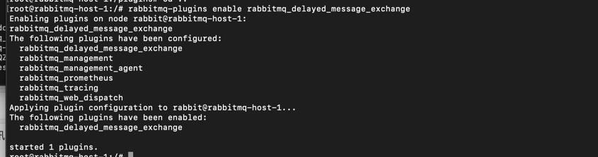

# 延迟消息：
##### 安装延迟消息插件， 在rabbitmq 3.5.7及以上的版本提供了一个插件（rabbitmq-delayed-message-exchange）来实现延迟队列功能。同时插件依赖Erlang/OPT 18.0及以上。 

- 1 官方下载插件 https://github.com/rabbitmq/rabbitmq-delayed-message-exchange/releases
- 2 把插件 rabbitmq_delayed_message_exchange-3.8.9-0199d11c.ez 复制到容器中：
   docker cp rabbitmq_delayed_message_exchange-3.8.9-0199d11c.ez 98:/plugins/
- 3 rabbitmq开启插件： rabbitmq-plugins enable rabbitmq_delayed_message_exchange
