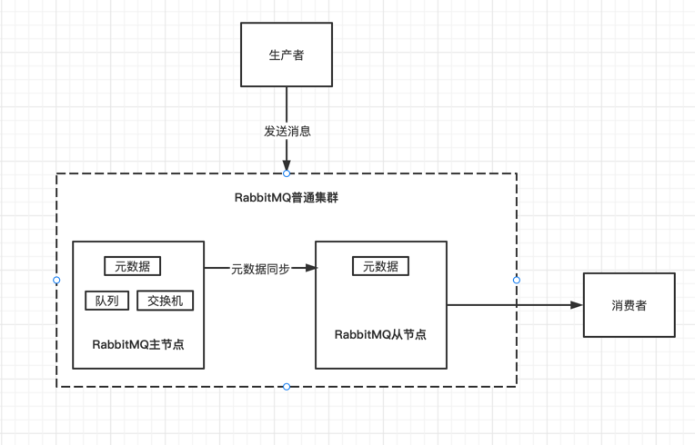
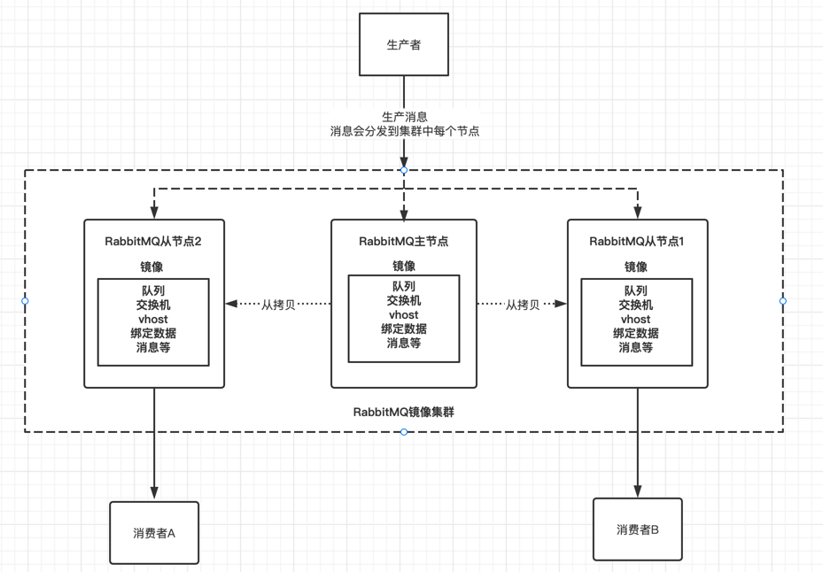
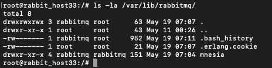
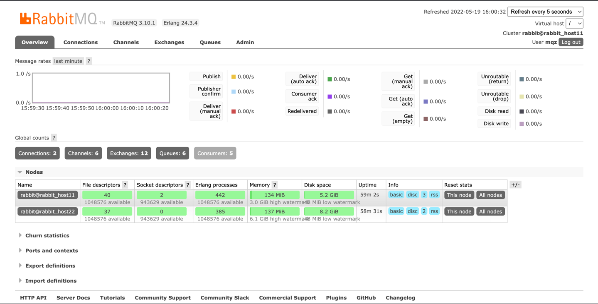
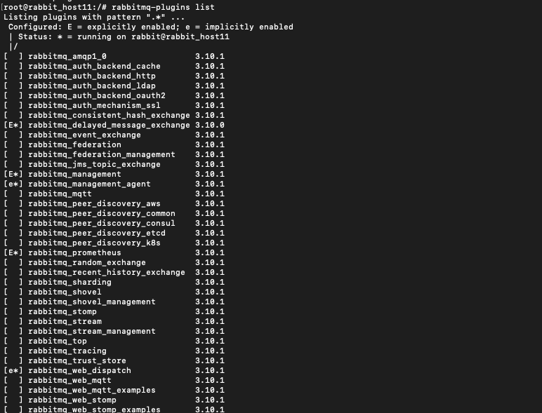
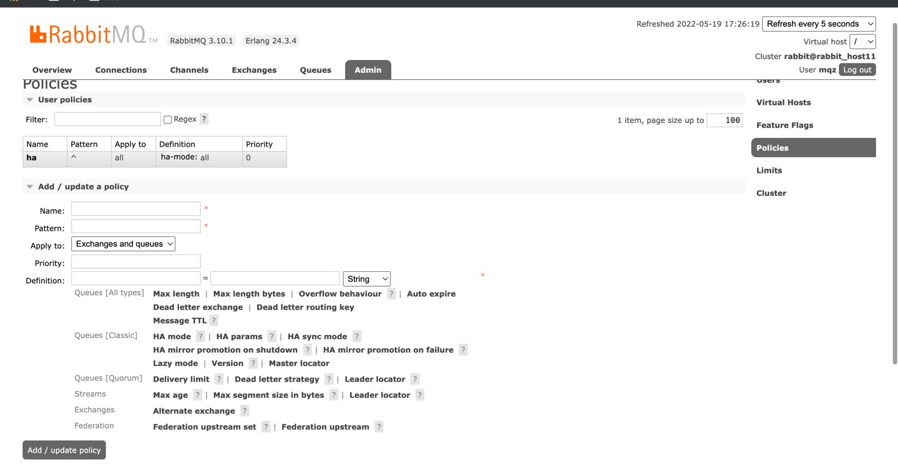

# Rabbitmq

Rabbitmq本身是给予 Erlang编写的，Erlang 语言天生就具有分布式的特性（.erlange.cookie实现集群并且集群节点的通信）


# RabbitMQ集群和高可用方案
- 普通集群模式
- 镜像复制模式

## 普通集群模式
每台机器中部署一个RabbitMQ服务节点，进而由多个机器组成一个RabbitMQ集群
普通模式中，消息数据是不会同步的，因为它们之间只同步 元数据，元数据中不包含消息数据。
若 客户端连接到 A节点，但是消息又在 B节点。这种情况下，普通集群模式无法实现消息在节点中的转发，
所以普通集群模式无法实现高可用，在这种情况下，可以使用镜像复制模式实现这种需求。

流程图


元数据包含：（不包含消息）
队列元数据： 队列名称、属性等
交换器数据： 交换器名称、属性
绑定元数据： 交换器绑定队列数据、交换器和交换器绑定数据
vhost元数据： vhost内的队列、和交换器绑定的数据、命名空间、安全属性之间的绑定关系数据

## 镜像复制模式
镜像复制模式是在普通集群模式基础上，通过 policy 模块来实现，使用镜像复制模式可以实现RabbitMQ的高可用方案
流程图


镜像复制模式相比于普通集群模式，会占用比较多的带宽，因为需要实现主节点到从节点的数据复制，所以镜像复制模式吞吐量会稍逊普通模式，
但是普通模式不能实现高可用，某个节点挂掉之后后，这个节点上的消息无法被消费，需要等待节点启动后才能被消费


## 节点类型
ram：内存节点 元数据存在内存中。如果消息持久化会存放在磁盘中，因为内存节点的读取速度块，一般客户端会连接内存节点
disc：磁盘节点 默认节点类型，需要保证至少一个磁盘节点，否则一旦宕机，则无法恢复数据，从而无法达到高可用！ 


## 普通集群模式搭建步骤

-  3台centos7服务器：
````
192.168.2.9
192.168.2.11
192.168.2.7
````

-  修改host文件
````
192.168.2.9 rabbit_host11
192.168.2.11 rabbit_host22
192.168.2.7 rabbit_host33
````
- 或者单独设置每台机器的：
````
hostnamectl set-hostname rabbit_host11
hostnamectl set-hostname rabbit_host22
hostnamectl set-hostname rabbit_host33
````

- docker-compose 安装rabbitmq，参考 yml 配置文件。先后启动 rabbitmq1 、 rabbitmq2 、 rabbitmq3
````
services:
  rabbitmq1:
    image: rabbitmq:3.8.9-management
    container_name: rabbitmq1
    hostname: rabbit_host1
    ports:
      - "4369:4369"
      - "5671:5671"
      - "5672:5672"
      - "15671:15671"
      - "15672:15672"
      - "25672:25672"
    extra_hosts:
      - "rabbit_host1:192.168.2.9"
      - "rabbit_host2:192.168.2.11"
      - "rabbit_host3:192.168.2.7"
    volumes:
      - /root/mqz/rabbitmq/docker/lib:/var/lib/rabbitmq
      - /root/mqz/rabbitmq/docker/log:/var/log/rabbitmq
    restart: always
    environment:
      - RABBITMQ_DEFAULT_USER=mqz
      - RABBITMQ_DEFAULT_PASS=mqz
      - RABBITMQ_NODENAME:rabbitmq1

````
- 统一三个rabbitmq的 /var/lib/rabbitmq/.erlang.cookie （也可能是在 $HOME/.erlang.cookie 目录） 文件，注意它是一个隐藏文件，就像我电脑里又隐藏的 .avi 文件一样🐶
  RabbitMQ 的集群是依赖 erlang 集群，而 erlang 集群是通过这个 cookie 进行通信认证
  将rabbitmq2 、 rabbitmq3 的 .erlang.cookie文件内容以 rabbitmq1的为主，拷贝时需要停止rabbitmq实例
  注意权限 ： chmod 600 /var/lib/rabbitmq/.erlang.cookie ，否则加入集群会报错
  
  随后重启rabbitmq： docker restart rabbitmq1 \ rabbitmq2 \ rabbitmq3


- 主节点执行：需要清空之前单机信息，docker则清空挂载的配置文件
````
rabbitmqctl stop_app
rabbitmqctl reset
rabbitmqctl start_app
````
- 从节点： 执行前需要停止该 rabbitmq 即 rabbitmqctl stop_app
````
rabbitmqctl [-n nodename] join_cluster {cluster_node} [—ram]
rabbitmqctl stop_app
rabbitmqctl reset 如果节点类型为 disc的时候需要执行
rabbitmqctl join_cluster --ram rabbit@rabbit_host11 或者 rabbitmqctl join_cluster --disc rabbit@rabbit_host11
rabbitmqctl start_app


如果节点以磁盘节点的形式加入，则需要先使用 rabbitmqctl reset 命令进行重置，然后才能加入现有群集，重置节点会删除该节点上存在的所有的历史资源和数据。
采用内存节点的形式加入时可以略过 reset 这一步，因为内存上的数据本身就不是持久化的
--ram 表示这是一个内存节点: 所有数据都存在内存中
--disc表示磁盘节点（默认也是磁盘节点）：所有数据都存在磁盘中
-n nodename： 指定需要操作的目标节点
cluster_node：需要加入的集群节点名
````





## 主节点执行 - 查看节点状态
rabbitmqctl status
````

Status of node rabbit@rabbit_host11 ...
Runtime

OS PID: 19
OS: Linux
Uptime (seconds): 3319
Is under maintenance?: false
RabbitMQ version: 3.10.1
Node name: rabbit@rabbit_host11
Erlang configuration: Erlang/OTP 24 [erts-12.3.2] [source] [64-bit] [smp:2:2] [ds:2:2:10] [async-threads:1] [jit]
Erlang processes: 444 used, 1048576 limit
Scheduler run queue: 1
Cluster heartbeat timeout (net_ticktime): 60

Plugins

Enabled plugin file: /etc/rabbitmq/enabled_plugins
Enabled plugins:

 * rabbitmq_delayed_message_exchange
 * rabbitmq_prometheus
 * prometheus
 * accept
 * rabbitmq_management
 * amqp_client
 * rabbitmq_web_dispatch
 * cowboy
 * cowlib
 * rabbitmq_management_agent

Data directory

Node data directory: /var/lib/rabbitmq/mnesia/rabbit@rabbit_host11
Raft data directory: /var/lib/rabbitmq/mnesia/rabbit@rabbit_host11/quorum/rabbit@rabbit_host11

Config files

 * /etc/rabbitmq/conf.d/10-defaults.conf

Log file(s)

 * /var/log/rabbitmq/rabbit@rabbit_host11_upgrade.log
 * <stdout>

Alarms

(none)

Memory

Total memory used: 0.1404 gb
Calculation strategy: rss
Memory high watermark setting: 0.4 of available memory, computed to: 3.2409 gb

reserved_unallocated: 0.0678 gb (48.27 %)
code: 0.0357 gb (25.39 %)
other_system: 0.0252 gb (17.93 %)
other_proc: 0.0189 gb (13.43 %)
other_ets: 0.0033 gb (2.37 %)
plugins: 0.0032 gb (2.28 %)
atom: 0.0014 gb (1.02 %)
mgmt_db: 0.0011 gb (0.8 %)
binary: 9.0e-4 gb (0.64 %)
connection_other: 4.0e-4 gb (0.25 %)
metrics: 3.0e-4 gb (0.19 %)
queue_procs: 2.0e-4 gb (0.11 %)
mnesia: 1.0e-4 gb (0.1 %)
connection_readers: 1.0e-4 gb (0.07 %)
msg_index: 0.0 gb (0.02 %)
connection_channels: 0.0 gb (0.02 %)
quorum_ets: 0.0 gb (0.02 %)
connection_writers: 0.0 gb (0.01 %)
quorum_queue_dlx_procs: 0.0 gb (0.0 %)
stream_queue_procs: 0.0 gb (0.0 %)
stream_queue_replica_reader_procs: 0.0 gb (0.0 %)
allocated_unused: 0.0 gb (0.0 %)
queue_slave_procs: 0.0 gb (0.0 %)
quorum_queue_procs: 0.0 gb (0.0 %)
stream_queue_coordinator_procs: 0.0 gb (0.0 %)

File Descriptors

Total: 5, limit: 1048479
Sockets: 2, limit: 943629

Free Disk Space

Low free disk space watermark: 0.05 gb
Free disk space: 5.5612 gb

Totals

Connection count: 2
Queue count: 6
Virtual host count: 1

Listeners

Interface: [::], port: 15672, protocol: http, purpose: HTTP API
Interface: [::], port: 15692, protocol: http/prometheus, purpose: Prometheus exporter API over HTTP
Interface: [::], port: 25672, protocol: clustering, purpose: inter-node and CLI tool communication
Interface: [::], port: 5672, protocol: amqp, purpose: AMQP 0-9-1 and AMQP 1.0

````

## 主节点执行 - 查看集群状态


rabbitmqctl cluster_status
````
root@rabbit_host11:/# rabbitmqctl cluster_status
Cluster status of node rabbit@rabbit_host11 ...
Basics

Cluster name: rabbit@rabbit_host11

Disk Nodes

rabbit@rabbit_host11
rabbit@rabbit_host22

Running Nodes

rabbit@rabbit_host11
rabbit@rabbit_host22

Versions

rabbit@rabbit_host11: RabbitMQ 3.10.1 on Erlang 24.3.4
rabbit@rabbit_host22: RabbitMQ 3.10.1 on Erlang 24.3.4

Maintenance status

Node: rabbit@rabbit_host11, status: not under maintenance
Node: rabbit@rabbit_host22, status: not under maintenance

Alarms

(none)

Network Partitions

(none)

Listeners

Node: rabbit@rabbit_host11, interface: [::], port: 15672, protocol: http, purpose: HTTP API
Node: rabbit@rabbit_host11, interface: [::], port: 15692, protocol: http/prometheus, purpose: Prometheus exporter API over HTTP
Node: rabbit@rabbit_host11, interface: [::], port: 25672, protocol: clustering, purpose: inter-node and CLI tool communication
Node: rabbit@rabbit_host11, interface: [::], port: 5672, protocol: amqp, purpose: AMQP 0-9-1 and AMQP 1.0
Node: rabbit@rabbit_host22, interface: [::], port: 15672, protocol: http, purpose: HTTP API
Node: rabbit@rabbit_host22, interface: [::], port: 15692, protocol: http/prometheus, purpose: Prometheus exporter API over HTTP
Node: rabbit@rabbit_host22, interface: [::], port: 25672, protocol: clustering, purpose: inter-node and CLI tool communication
Node: rabbit@rabbit_host22, interface: [::], port: 5672, protocol: amqp, purpose: AMQP 0-9-1 and AMQP 1.0

Feature flags

Flag: classic_mirrored_queue_version, state: enabled
Flag: drop_unroutable_metric, state: enabled
Flag: empty_basic_get_metric, state: enabled
Flag: implicit_default_bindings, state: enabled
Flag: maintenance_mode_status, state: enabled
Flag: quorum_queue, state: enabled
Flag: stream_queue, state: enabled
Flag: user_limits, state: enabled
Flag: virtual_host_metadata, state: enabled
````



## 镜像复制模式-高可用模式
- 镜像队列模式相比较普通模式，镜像模式会占用更多的带宽来进行同步，所以镜像队列的吞吐量会低于普通模式。
  但普通模式不能实现高可用，某个节点挂了后，这个节点上的消息将无法被消费，需要等待节点启动后才能被消费。
- 需要使用 policy 模块，policy主要用于设置 Exchange 或者 Queue 的数据需要如何复制，同步到其他节点
- 设置主节点同步从节点 交换机、队列的策略规则
 1.命令： rabbitmqctl set_policy -p / ha "^" '{"ha-mode":"all"}'  
         rabbitmqctl -n rabbit1 set_policy ha-all "^" '{"ha-mode":"all"}'
````    
ha ： 策略名称
^  ： 匹配规则， ^ 则表示匹配所有 ^Q 则匹配名字
{"ha-mode":"exactly","ha-params":2} ： 是策略的定义， ha-mode和ha-params组合使用

            ha-mode   ha-params   说明 
             all      （empty）   队列镜像到集群所有节点
             exactly   int值      队列镜像到集群内指定数量节点，若集群内节点数少于该值，队列将会镜像到所有节点，若大于该值，而且一个包含镜像的节点停止，则新的镜像不会在其他节点创建
             nodes     节点名称    队列镜像到指定节点，指定节点不在集群中不会报错，当队列申明时候，如果指定节点不在线，则队列会被创建在客户端连接的节点上
````
- 设置策略匹配所有名称是amp开头的队列都存储在2个节点上的命令如下
````  
  rabbitmqctl set_policy -p / ha "^amp*" '{"ha-mode":"exactly","ha-params":2}'
````  
- 设置策略匹配所有名称的队列都进行高可用配置
````
  rabbitmqctl set_policy -p / ha "^" '{"ha-mode":"all","ha-sync-mode":"automatic"}'

````
- 查询策略 #查看vhost下的所有的策略（policies ）
````
rabbitmqctl list_policies -p /
````


 2.web管理界面方式：  



## 集群的关闭和重启
无法一条命令关闭或重启集群，需要一一进行操作！
假设在一个三节点的集群当中，关闭的顺序为 node1，node2，node3，如果 node1 因为故障暂时没法恢复，此时 node2 和 node3 就无法启动。想要解决这个问题，可以先将 node1 节点进行剔除，命令如下：
rabbitmqctl forget_cluster_node rabbit@node1 --offline  # --offline ： 允许节点在自己没有启动的情况下可以将其他节点删除

rabbitmqctl forget_cluster_node rabbit@node1 ： 强制删除节点出集群


- 解除集群 （主、从）
  rabbitmqctl stop_app
  rabbitmqctl reset
  rabbitmqctl start_app

# 基于 HAProxy + Keepalived 高可用集群


